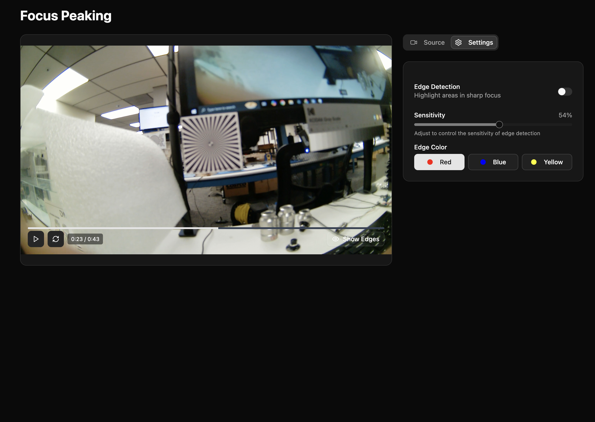
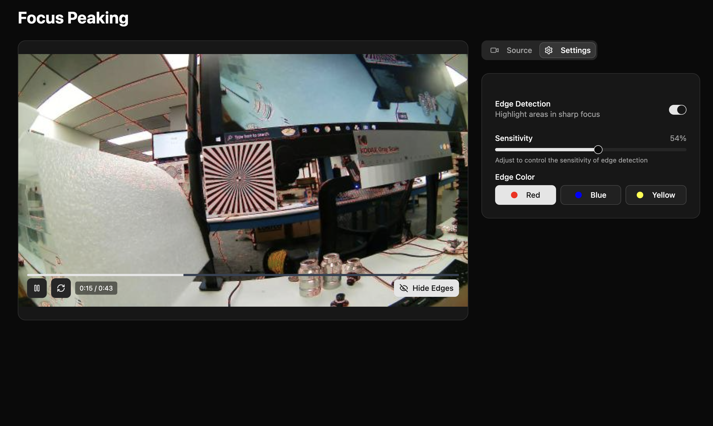

# Edge Detection App

A real-time edge detection application that highlights detailed contours in video input using advanced computer vision algorithms.

## Screenshots

### Focus Peaking Disabled


### Focus Peaking Enabled


## Features

- **Real-time Edge Detection**: Processes video frames to identify and highlight edges and contours
- **Color Customization**: Choose different colors for the edge highlighting
- **Source Options**: Process video files or webcam input
- **Simple UI**: Clean interface with intuitive controls
- **Cross-platform**: Works on macOS, Windows, and Linux

## Tech Stack

- **Frontend**: React, TypeScript, Tailwind CSS
- **Backend**: Python, OpenCV, Socket.IO
- **Communication**: Real-time bidirectional data transfer

## Prerequisites

- **Python 3.7+** (for backend processing)
- **Node.js** (for React frontend)

## Quick Start

1. Clone this repository:
   ```bash
   git clone https://github.com/AjStraight619/edge-detection-app.git
   cd edge-detection-app
   ```

2. Run the application:
   ```bash
   # On macOS/Linux
   ./start-app.sh
   
   # On Windows
   bash start-app.sh
   ```

If you get a "permission denied" error, run:
```bash
chmod +x start-app.sh backend/setup.sh backend/start.sh
./start-app.sh
```

The setup script will automatically:
- Make all scripts executable
- Create a Python virtual environment
- Install all required dependencies
- Start the backend server
- Launch the frontend development server

## Project Structure

```
edge-detection-app/
├── backend/             # Python backend
│   ├── server.py        # Socket.IO server with OpenCV processing
│   ├── requirements.txt # Python dependencies
│   ├── setup.sh         # Backend setup script
│   └── start.sh         # Backend start script
├── frontend/            # React frontend
│   ├── src/             # Source code
│   │   ├── components/  # React components
│   │   ├── providers/   # Context providers
│   │   └── ...
│   └── public/          # Static assets
└── start-app.sh         # Main application launcher
```

## Manual Setup

If you prefer to set up components separately:

### Backend
```bash
cd backend
chmod +x setup.sh start.sh  # If needed
./setup.sh  # Creates virtual environment and installs dependencies
./start.sh  # Starts the backend server
```

### Frontend
```bash
cd frontend
npm install
npm run dev
```

## How It Works

1. The frontend captures video frames from either a file or webcam
2. Frames are sent to the Python backend via Socket.IO
3. The backend uses OpenCV to detect edges and contours in the image
4. Processed frames with highlighted edges are returned to the frontend
5. The frontend displays the original video with edge detection overlay

## Troubleshooting

- **Permission errors**: Run `chmod +x start-app.sh backend/setup.sh backend/start.sh` to make scripts executable
- **Port 8000 in use**: Kill the process using port 8000 or change the port in backend/server.py
- **Dependency issues**: Run `cd backend && ./setup.sh` to reinstall dependencies
- **Windows users**: You may need to install Git Bash or WSL to run the bash scripts

## Development
- The frontend uses Vite's hot module replacement for fast development

